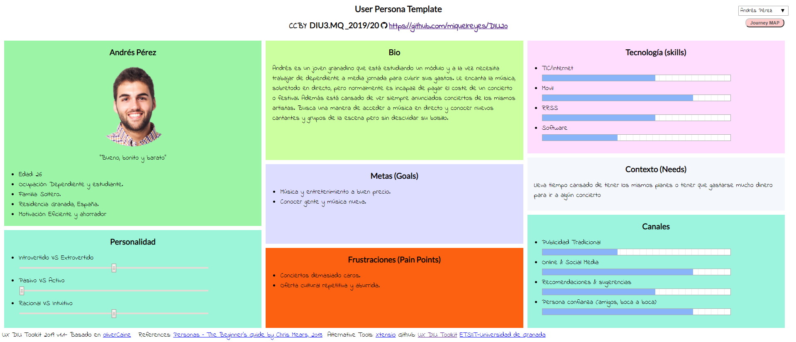
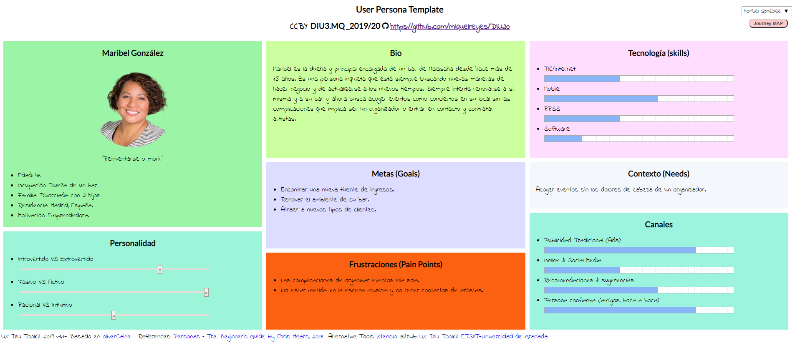
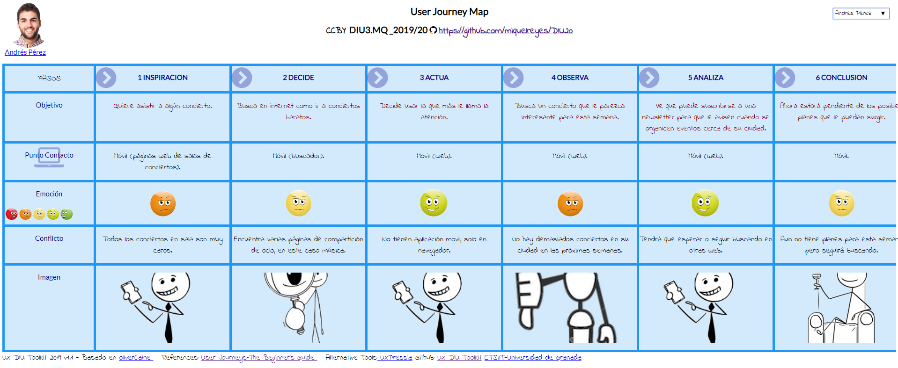
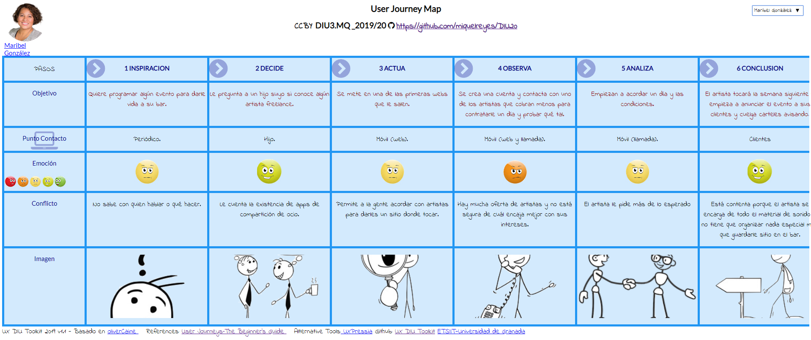

## DIU - Practica1, entregables

- Desk research: Análisis Competencia 
- 2 Personas 
- 2 User Journey Map  ( 1 por persona)
- Revisión de Usabilidad 

1.a Competitive Analysis
-----

La plataforma elegida ha sido SofaConcerts (https://www.sofaconcerts.org/en) que es una plataforma para compartir ocio, en este caso musical, tanto si eres un artista buscando donde tocar, alguien con un local o espacio donde llevar a cabo un concierto (incluso una casa) o si eres un usuario buscando una experiencia musical diferente. Otras alternativas que miré fueron Sofar Sounds (https://www.sofarsounds.com/) y Artery (https://artery.is/).

1.b Personas
-----

Se han creado dos personas:

- **Andrés**, un joven que busca nuevos eventos musicales que no afecten demasiado a su bolsillo así como conocer más gente.
- **Maribel**, una mujer propietaria de un bar que busca acoger eventos que atraigan a nuevo público a su local así como apoyar a los artistas de su ciudad.

1.c User Journey Map
----

He escogido una experiencia de usuario para cada persona teniendo en cuenta sus necesidades. Andrés busca conciertos baratos en internet y explora la página y a Maribel se le recomienda una plataforma de compartición de ocio y explora artistas cerca de su ubicación que buscan sitios donde tocar.

1.d Usability Review
----
La revisión de usabilidad se puede ver en el documento "Revision_usabilidad.pdf". Ha obtenido una nota de 75/100.

Como resumen de la valoración indicar que es una página web (no existe aplicación móvil por el momento) que funciona correctamente. Diferencia claramente las secciones según el objetivo de cada usuario, si busca artistas, locales o conciertos, y en cada uno de ellos se muestran las opcionas con claridad. No es especialmente atractiva pero cumple en general con la mayoría de funciones que una persona necesita. Como puntos negativos, he encontrado en algún momento mensajes en alemán en lugar de inglés y que no ofrece ayuda en línea.
